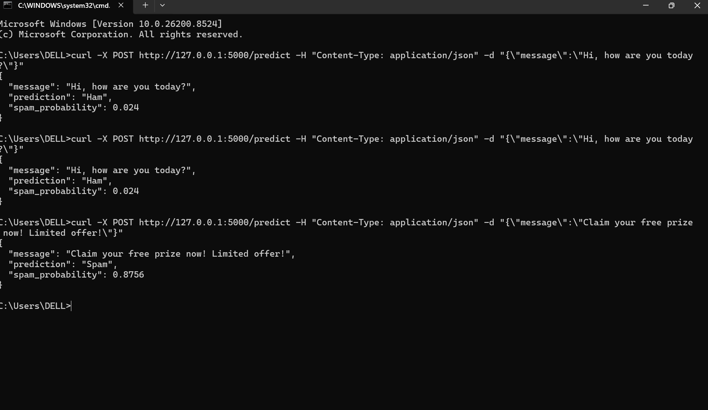
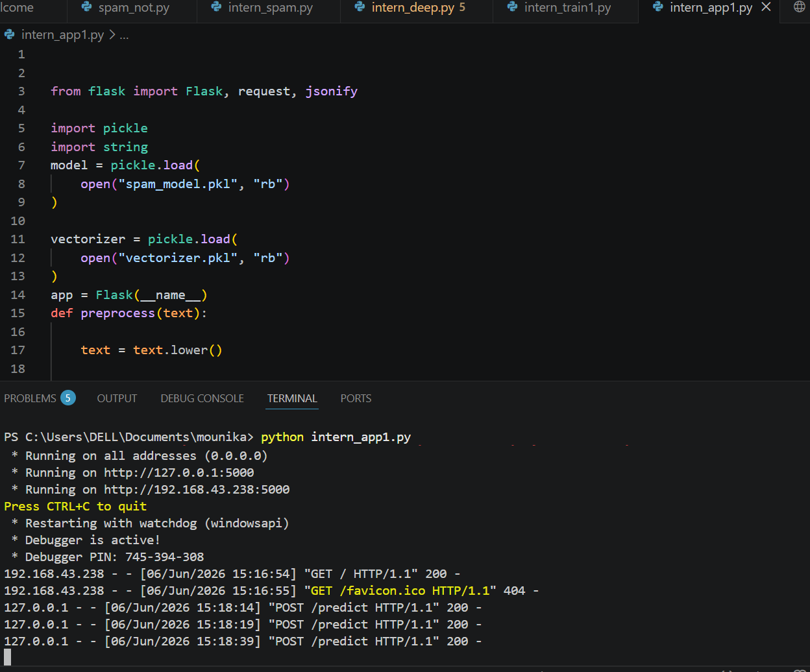

# InternSpark AI Internship Projects

## Overview

This repository contains the projects completed as part of the InternSpark Artificial Intelligence Internship Program.

The internship tasks focused on Machine Learning, Deep Learning, and Model Deployment. Each project was implemented using Python and includes source code, reports, evaluation results, and supporting files.

---

## Repository Structure

```text
interspark_internship_of_ai

├── task1_ml
│   ├── source code
│   ├── report.pdf
│   └── README.md
│
├── task2
│   ├── image_classification.py
│   ├── cifar10_model.keras
│   ├── report.pdf
│   └── README.md
│
├── task3
│   ├── app.py
│   ├── train_model.py
│   ├── Dockerfile
│   ├── requirements.txt
│   ├── spam_model.pkl
│   ├── vectorizer.pkl
│   ├── report.pdf
│   └── README.md
```

---

# Task 1: Machine Learning Classification Project

## Objective

Build and evaluate a supervised Machine Learning classification model for spam message detection.

## Techniques Used

* Data Preprocessing
* TF-IDF Vectorization
* Train-Test Split
* Cross Validation
* Model Comparison

## Algorithms Compared

* Naive Bayes
* Logistic Regression

## Evaluation Metrics

* Accuracy
* Precision
* Recall
* F1 Score
* ROC-AUC

## Results

### Naive Bayes

| Metric    | Value   |
| --------- | ------- |
| Accuracy  | 96.59%  |
| Precision | 100.00% |
| Recall    | 74.67%  |
| F1 Score  | 85.50%  |
| ROC-AUC   | 98.16%  |

### Logistic Regression

| Metric    | Value  |
| --------- | ------ |
| Accuracy  | 94.26% |
| Precision | 95.74% |
| Recall    | 60.00% |
| F1 Score  | 73.77% |
| ROC-AUC   | 98.70% |

### Conclusion

Naive Bayes achieved the best overall performance and was selected as the final model.

---

# Task 2: Deep Learning Image Classification

## Objective

Develop a Deep Learning model using TensorFlow and Transfer Learning for image classification.

## Dataset

* CIFAR-10 Dataset

Classes:

* Airplane
* Automobile
* Bird
* Cat
* Deer
* Dog
* Frog
* Horse
* Ship
* Truck

## Technologies Used

* TensorFlow
* Keras
* MobileNetV2
* Transfer Learning
* Data Augmentation

## Features Implemented

* Pretrained MobileNetV2
* Image Augmentation
* Training and Validation Curves
* Confusion Matrix
* Classification Report
* Model Saving and Loading
* User Image Testing

## Deliverables

* Python Training Script
* Saved Model (.keras)
* Performance Metrics
* Training Graphs

### Learning Outcome

This project provided practical experience with transfer learning, image classification, model evaluation, and inference using TensorFlow.

---

# Task 3: Model Deployment using Flask and Docker

## Objective

Deploy the trained Spam Detection Machine Learning model using Flask and containerize it with Docker.

## Features

* REST API
* Real-Time Prediction
* JSON Request Handling
* JSON Response Generation
* Docker Containerization

## API Endpoint

### Home Endpoint

```http
GET /
```

Response:

```text
Spam Detection API Running Successfully!
```

### Prediction Endpoint

```http
POST /predict
```

Sample Request:

```json
{
  "message": "Claim your free prize now!"
}
```

Sample Response:

```json
{
  "message": "Claim your free prize now!",
  "prediction": "Spam",
  "spam_probability": 0.8756
}
```

## Docker Commands

Build Image:

```bash
docker build -t spam-api .
```

Run Container:

```bash
docker run -p 5000:5000 spam-api
```

---

## Screenshots

### Flask Server Running

Add your screenshot here:

```md

```

### API Testing

Add your screenshot here:

```md

```

---

## Skills Demonstrated

* Python Programming
* Machine Learning
* Deep Learning
* Data Preprocessing
* Transfer Learning
* Model Evaluation
* API Development
* Flask Framework
* Docker Containerization
* GitHub Project Management

---

## Internship Outcome

Through these projects, I gained hands-on experience in the complete AI workflow:

1. Building Machine Learning models
2. Evaluating and comparing algorithms
3. Developing Deep Learning applications
4. Using Transfer Learning techniques
5. Deploying models through APIs
6. Containerizing applications using Docker

These projects strengthened my practical understanding of Artificial Intelligence, Machine Learning, Deep Learning, and Model Deployment.

---

## Author

**L Mounika**

InternSpark AI Internship Program
